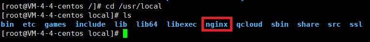
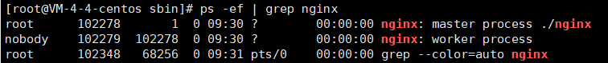

# Xshell7使用


#### 解压安装包

Linux下*.tar.gz文件解压缩命令

1.压缩命令：

　　命令格式：tar -zcvf 压缩文件名.tar.gz 被压缩文件名
```
  tar -zcvf name.tar.gz newname
```

可先切换到当前目录下。压缩文件名和被压缩文件名都可加入路径。

2.解压缩命令：

　　命令格式：tar -zxvf 压缩文件名.tar.gz

```
  tar -zxvf name.tar.gz
```
　　解压缩后的文件只能放在当前的目录。
```
  tar -zxvf name.tar.gz -C/usr
```
解压缩后放在根目录下的usr目录下

- z ：代表压缩
- c ：代表打包
- x ：代表解压
- v ：代表的是过程
- f ：代表的是指定的文件名

### 添加Java环境变量
进入`/etc/profile`文件，进行如下的配置

这里的JAVA_HOME后面的路径是jdk的位置

```
#set java env
export JAVA_HOME=/usr/lib/jdk/jdk1.8.0_171
export JRE_HOME=${JAVA_HOME}/jre  
export CLASSPATH=.:${JAVA_HOME}/lib:${JRE_HOME}/lib  
export PATH=${JAVA_HOME}/bin:$PATH
```
刷新环境变量
>source /etc/profile

检查是否成功

>javax -version


#### 开启tomcat服务

1. 当前会话启动

    这种方式启动的tomcat会在客户端断开连接的时候关闭服务。

    ```
    ./startup.sh
    ```
3. 永久启动

#### 安装于卸载

在linux中安装软件分为三个步骤，解压安装包，预安装（为编译做好准备）=>进行软件编译=>完成安装=>删除安装产生的临时文件

1. **./configure** ：该命令的目的是为软件进行预编译，只有通过该命令之后没有错误才可以进行软件的安装。
    ```
    ./configure
    ```
    需要注意的是，并不是所有的软件都带有该命令，具体的操作可以查看控制台给出的信息，或直接查看`INSTALL`和`README`文件。

2. **make** ：该命令进行软件编译

3. **make install** ：完成软件的安装

4. **make clean** ：删除安装软件产生的临时文件。


在执行2.3.4项操作的时候可以通过`$$`进行连接，表示执行成功上一项之后接着执行下一项。
```
make && make install && make clean
```

**使用prefix指定解压位置**
使用prefix命令可以在`./configure`后面使用，也可以在`make`时使用

*./configure* :
```
  configure --prefix=/usr
```
这样在执行安装的是由就会将文件解压安装到usr目录下。

*make* :
```
make --prefix=path install
```

#### 安装使用Nginx

安装Nginx需要以下几个依赖：zlib、openssl、gcc、pcre，由于安装Nginx需要满足所有依赖，所以放在最后安装。

如果在安装的过程中`make`命令无法使用则需要执行以下命令，主要用于添加`gcc`依赖。
```
yum -y install gcc gcc-c++ autoconf automake
```

**启动Nginx**

安装好Nginx之后，Nginx会在`/usr/local/`路径下生成`Nginx`目录。


在该目录中执行`./nginx`命令就可以启动Nginx了。

使用 **`ps -ef | grep nginx`** 命令来测试启动。



1.启动命令: ./nginx
2.重启命令: ./nginx -s reload
3.关闭命令: ./nginx -s stop
