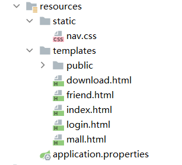
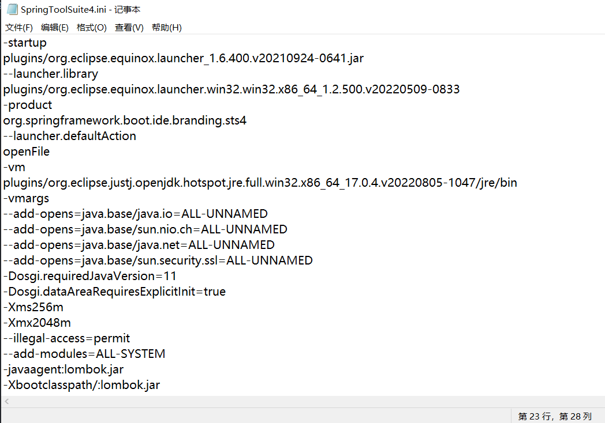

# SpringBoot使用
**SpringBoot并不是一门技术，而是整合了我们日常经常使用的一些其他技术，从而大大减少了我们开发中对于环境的搭建**


**<font color="red">SpringBoot项目会根据项目依赖和相关的配置文件来进行自动装配，这点很方便，大大减少了我们编码的复杂度。但是需要注意，如果有些依赖需要进行资源配置但是没有进行配置就会报错，比如添加了MySQL或mybatis依赖但是没有进行资源配置，那么项目启动的时候就会报错。</font>**


## @Autowired注解


## 使用注解对spring自动装载的屏蔽
  在`@SpringBootApplication`注解后面添加`exclude`[^1]属性来进行某些不需要进行自动装配的地方进行屏蔽


## static目录和templates目录的区别

static目录中主要用于存放静态资源文件，比如css，js，img文件，这些文件都不会动态改变。

templates目录中用于存放会动态变化的html文件，当我们在SpringBoot项目中添加了Thymeleaf依赖的时候，项目启动时只会自动检测该目录中的html文件。


## 使用Thymeleaf
相应依赖：
```
<dependency>
    <groupId>org.springframework.boot</groupId>
    <artifactId>spring-boot-starter-thymeleaf</artifactId>
</dependency>
```

使用Thymeleaf需要在html头部进行引入并声明命名空间

>xmlns:th="http://www.thymeleaf.org

```
  <html lang="en" xmlns:th="http://www.thymeleaf.org">
```

当添加了该依赖之后，Thymeleaf会以默认的配置对`resource/templates`目录中的html文件进行渲染。

Thymeleaf主要的作用是将html代码模板化。

>与 Spring Boot 其他自定义配置一样，我们可以在 application.properties/yml 中修改以 spring.thymeleaf 开始的属性，以实现修改 Spring Boot 对 Thymeleaf 的自动配置的目的。

**使用拦截器进行页面跳转：**
```
import org.springframework.stereotype.Controller;
import org.springframework.web.bind.annotation.GetMapping;
import org.springframework.web.bind.annotation.PostMapping;

@Controller
public class LoginController {

	@PostMapping("login")
	public String login1() {
		System.out.println("进入登录界面");
		return"login";
	}
	@GetMapping("login")
	public String login2() {
		System.out.println("进入登录界面");
		return"login";
	}
}

```


>拦截器会自动拦截所有请求链接为`login`的请求，之后Thymeleaf会通过返回的字符串找到**templates**目录中相同的html文件并进行跳转。


## 控制器

**控制器注解主要有两种：**
- **Controller：** 将一个Java类标识成控制器类。

- **RestController：** 带有该注解的类中的所有方法都自带`@ResponseBody`注解。
#### @RequestMapping注解
RequestMapping注解主要用于对浏览器的请求地址的拦截。

#### @ResponseBody注解
添加该注解之后的方法会将方法返回的字符串返回给当前页面，可以用于Ajax请求。


## 获得相应内容
获取相应内容有三种方式
- **通过`HttpServletRequest`的parameter获得：**

  >localhost:8080/login?name=lzy&password=123456

  ```
  @RequestMapping("login")
  public String updateById(HttpServletRequest request){
      String name = request.getParameter("name");
      String password = request.getParameter("password");
      return null;
  }
  ```

  在参数列表中引入`HttpServletRequest`对象，并通过该对象中的`getParameter`方法获得相应的参数。

- **通过形参获取请求参数：**
  在拦截器方法的参数列表中引入和请求参数相同的形参，SpringMVC会自通过，参数名自动分配值。

    >localhost:8080/login?name=lzy&password=123456

    ```
    @RequestMapping("login")
    public String updateById(String name,String password){
        System.out.println("name:"+name+",password:"+password);
        return null;
    }
    ```

- **通过实体类对象来获取请求参数：**

  *<font color="red">这是推荐使用的方法，可以有效解决问题，且不用考虑形参过多的问题。</font>*

    >localhost:8080/login?name=lzy&password=123456

    ```
    @RequestMapping("login")
    public String updateById(Student student){
        System.out.println(student);
        return null;
    }
    ```


## 拦截器
> 拦截器实现： 设置拦截器 => 注册拦截器 => 在不同的地方被触发

**<font color="red">一定要在拦截器上添加@Component注解和在注册控制器的类上添加@Configuration注解，否则spring就会找不到拦截器，从而导致拦截器失效</font>**

1. **设置拦截器：**
    通过实现`HandlerInterceptor `接口并添加`@Component`注解来表名该类是一个需要被扫描的组件。
    大多数情况通过实现`HandlerInterceptorAdapter`接口，他们都是继承自`HandlerInterceptor`接口

    ```
    import javax.servlet.http.HttpServletRequest;
    import javax.servlet.http.HttpServletResponse;
    import org.springframework.stereotype.Component;
    import org.springframework.web.servlet.HandlerInterceptor;
    import lombok.extern.slf4j.Slf4j;

    @Slf4j
    @Component
    public class MyInterceptor implements HandlerInterceptor {
    	@Override
    	public boolean preHandle(HttpServletRequest request, HttpServletResponse response, Object handler)
    			throws Exception {
    		log.info("拦截器:"+request.getParameter("username"));
    		return true;
    	}
    }
    ```
  - preHandle:
      **该方法在执行器方法之前执行。** 返回值为Boolean类型，如果返回false,表示拦截器不再向下执行；如果返回true,表示放行，程序向下执行(如果后边没有其他Interceptor,就会执行Controller方法)。所以，此方法可对方法进行判断，决定程序是否继续执行，或者进行一些初始化操作及对请求进行预处理。
    
  - postHandle:
    **该方法在执行控制器方法调用之后，且在返回ModelAndView之前执行。** 由于该方法会在DispatcherServlet进行返回视图渲染之前被调用，所以此方法多被用于处理返回的视图，可通过此方法多被用于处理返回的视图，可通过此方法对请求域中的模型和视图做进一步的修改

2. **注册拦截器：**
    注册拦截器有两种方法，分别是

      - 继承WebMvcConfigurationSupport类

          ```
          @Configuration
          public class MyInterceptorConfig extends WebMvcConfigurationSupport {

              @Override
              protected void addInterceptors(InterceptorRegistry registry) {
                  registry.addInterceptor(new MyInterceptor()).addPathPatterns("/**");
                  super.addInterceptors(registry);
              }
          }
          ```


          这种方法会导致默认的静态资源被拦截，需要我们手动将静态资源开放，需要重写`addRsourceHandlers`方法来释放静态资源
          ```
          @Override
          protected void addResourceHandlers(ResourceHandlerRegistry registry) {
              registry.addResourceHandler("/**").addResourceLocations("classpath:/static/");
              super.addResourceHandlers(registry);
          }

          ```

      - 实现实现WebMvcConfigurer接口
      创建一个自定义类实现WebMvcConfigurer接口，重写addInterceptors方法，此方法不会拦截静态资源。

        ```
        @Configuration
        public class MyInterceptorConfig implements WebMvcConfigurer {
            @Override
            public void addInterceptors(InterceptorRegistry registry) {
                // 实现WebMvcConfigurer不会导致静态资源被拦截
                registry.addInterceptor(new MyInterceptor()).addPathPatterns("/**");
            }
        }
        ```
由于这两种方式的不同：
继承 WebMvcConfigurationSupport类的方式推荐用在前后端分离的项目中，后台不需要访问静态资源（就不需要放开静态资源了），当然也可以在前后端不分离中，如果需要访问静态资源使用上面的方式重写addResourceHandlers方法即可；
实现 WebMvcConfigure接口的方式推荐用在非前后端分离的项目中，因为需要读取一些图片、css、js文件等等，当然也可以使用在前后端分离项目。


- afterCompletion:
**该方法在执行完控制器之后执行。** 由于是在Controller方法执行完毕之后执行该方法，所以该方法适合进行一些资源清理、记录日志信息等处理操作。

## 接收前端参数的四种方式

1. **通过原生`HttpServletRequest`进行参数的接收。**

    ```
    @RequestMapping("/b")
    public String b(HttpServletRequest request,HttpServletResponse response) throws IOException {
      Integer id = request.getParameter("id");
      mapper.findById(id);
      return "list";
    }
    ```
    这里可以直接在参数列表中添加HttpServiletRequest，因为这是经过springboot封装过的，实际上使用的还是底层的servlet

2. **通过`@Param`注解进行参数的定义**
    >链接：**localhost:8080:/user/login?username=lzy&password=123**

    在接口中通过注解来获得相对应的参数

    ```
    @RequestMapping(method = {RequestMethod.GET,RequestMethod.POST},path = "/user/login")
      public String checkLogin(@Param("username")String username,@Param(",password")String password) {
      log.info("username:"+username+"password:"+password);
      //通过用户名和密码判断用户是否存在
      User user = service.checkUser(username, password);
      if(user == null) {
        return "login";
      }else {
        return "index";
      }
    }
    ```

3. **通过`@PathVariable`注解进行**
    >链接：*localhost:8080/id/1*

    通过占位符的方式进行参数的获取

    ```
    @RequestMapping("test/{id}/{name}")
    public String test(@PathVariable("id") Integer id,@PathVariable("name") String name) {
      System.out.println(id+"-----"+name);
      return "";
    }
    ```
    这里需要注意的是，占位符和注解中的值要一致。


4. **通过实体类直接获取**
    <font color="red">这种方式是最推荐的方式</font>

    >链接：**localhost:8080/update?id=1&status=0&creatTime=2022**

    实体类：
    ```
    @javax.persistence.Entity
    @Data
    public class Entity {

    	//构造方法
    	public Entity(Integer id, Integer status, String creatTime) {
    		super();
    		this.id = id;
    		this.status = status;
    		this.creatTime = creatTime;
    	}

    	public Entity() {
    		super();
    		// TODO Auto-generated constructor stub
    	}

    	//get set
    	private Integer id;
    	private Integer status;
    	private String creatTime;

    }
    ```

    控制器：

    ```
    @RequestMapping("update")
    public String test(Entity entity) {
      System.out.println(entity);
      return "";
    }
    ```

    只要链接中的参数和实体类中的参数对应，spring就会自动通过属性名进行装配，如果属性名不一致，那么该属性的值就是null。
---

## SpringBoot整合MyBatis
**引入依赖**
```
<dependency>
  <groupId>org.mybatis.spring.boot</groupId>
  <artifactId>mybatis-spring-boot-starter</artifactId>
  <version>2.2.2</version>
</dependency>
<dependency>
  <groupId>mysql</groupId>
  <artifactId>mysql-connector-java</artifactId>
  <scope>runtime</scope>
</dependency>
```

  在使用Mybatis的时候需要引入mysql和mybatis的maven依赖，之后spring就会自动进行资源扫描，所以需要对数据库链接进行配置。

  想要在springboot项目中进行数据库的关联，十分的简单，只需要在**resources**文件夹中的的<font color="red">application.properties</font>文件中添加jdbc所需要的几个相关配置就可以成功启动项目了，这个时候启动项目，spring会自动检测配置文件中的内容，并进行配置。

**properties文件：**
```
spring.datasource.driver-class-name = com.mysql.cj.jdbc.Driver
spring.datasource.url = jdbc:mysql://localhost:3306/test?useUnicode=true&characterEncoding=utf8&useSSL=false&allowPublicKeyRetrieval=true
spring.datasource.username = root
spring.datasource.password = 123456
```
**yml文件：**
```
spring:
  datasource:
    driver-class-name: com.mysql.cj.jdbc.Driver
    url: jdbc:mysql://localhost:3306/test?useUnicode=true&characterEncoding=utf8&useSSL=false&allowPublicKeyRetrieval=true
    username: root
    password: 123456
```
## 请求转发和重定向

  在SpringBoot中请求转发和重定向的使用有两种方法。
  **请求转发**
  1. 在返回的字符串中添加forward关键字，并待带上需要转发的地址。
      ```
      import org.springframework.stereotype.Controller;
      import org.springframework.web.bind.annotation.RequestMapping;
      import com.example.demo.dao.entity.Student;

      @Controller
      public class StudentController {
      	@RequestMapping("test")
      	public String  a(Student stu) {
      		System.out.println(stu);
      		System.out.println("请求转发");
      		return "forward:/add";
      	}
      }
      ```
      <font color="red">在有@ResponseBody注解的情况下，使用该方法进行请求转发是无效的。</font>


    2. 使用servlet提供的API，这样可以使用`@RestController`注解

        ```
        @RequestMapping("test")
        @ResponseBody
        public void a(Student stu,HttpServletRequest request,HttpServletResponse response) throws ServletException, IOException {
          request.getRequestDispatcher("/add").forward(request, response);
        }
        ```
        虽然这里使用了@ResponseBody注解，但是效果其实是和`forward`方法是一样的。


**重定向**
重定向的方式有三种

1. MVC自带的重定向方法：
    ```
    @Controller
    public class StudentController {
      @RequestMapping("test")
      public String  a(Student stu) {
        System.out.println(stu);
        System.out.println("请求转发");
        return "add";
      }
    }
    ```
    这里添加了Thymeleaf，所以并不用添加文件的后缀也会找到相应的html页面。

2.  使用redirect关键字。

    ```
    @RequestMapping("/test")
  	public String b() {
  		return "redirect:add";
  	}
    ```
    <font color="red">在有@ResponseBody注解的情况下，使用该方法进重定向是无效的。</font>

3. 使用ServletAPI进行重定向
    ```
    @RequestMapping("/test")
  	public void b(HttpServletRequest request,HttpServletResponse response) throws IOException {
  		response.sendRedirect(request.getContextPath()+"add");
  	}
    ```

    使用API进行重定向时，一般会在url之前加上：`request.getContextPath()`，意思是返资源的根路径，且使用该方法即在有`@ResponseBody`注释的情况下也可以正常使用。


## SpringBoot使用SpringDataJPA

**<font color="red">JPA是Hibernate的封装</font>**

引入相关依赖。

```
<dependency>
  <groupId>org.springframework.boot</groupId>
  <artifactId>spring-boot-starter-data-jpa</artifactId>
</dependency>
<dependency>
  <groupId>mysql</groupId>
  <artifactId>mysql-connector-java</artifactId>
  <scope>runtime</scope>
</dependency>
```
*使用jpa和使用mybatis是一样的，都需要对yml或properties文件进行配置*
```
spring.datasource.driver-class-name = com.mysql.cj.jdbc.Driver
spring.datasource.url = jdbc:mysql://localhost:3306/test?useUnicode=true&characterEncoding=utf8&useSSL=false&allowPublicKeyRetrieval=true
spring.datasource.username = root
spring.datasource.password = 123456
```

**使用jpa的过程是：**

1. 创建与数据库表中字段属性相对应的实体类，添加**Entity，Id**注解
    ```
    import javax.persistence.Entity;
    import javax.persistence.Id;

    @Entity
    public class Student {

    	@Id
            @GeneratedValue(strategy = GenerationType.IDENTITY)
            //设置主键规则。  
            @Column("id")
            //对应数据库中字段的名字
    	private Integer id;
    	private String name;
    	private String gender;
    }

    ```


        HAUTO：JPA自动选择合适的策略，是默认选项

        IDENTITY：采用数据库 ID自增长的方式来自增主键字段，Oracle 不支持这种方式

        SEQUENCE：通过序列产生主键，通过@SequenceGenerator注解指定序列名，MySql 不支持这种方式

        TABLE：通过一张数据库表的形式帮助我们完成主键自增


    **常用注解：**

    <table><thead><tr><th align="left">注解</th><th align="left">作用</th><th align="left">常用属性</th></tr></thead><tbody><tr><td align="left">@Data</td><td align="left">给实体类加get/set/toString/EqualsAndHashCode方法，是lombok的注解</td><td align="left"></td></tr><tr><td align="left">@Entity</td><td align="left">指定当前类是实体类</td><td align="left"></td></tr><tr><td align="left">@Table</td><td align="left">指定实体类和表之间的对应关系</td><td align="left">name：指定数据库表的名称</td></tr><tr><td align="left">@EntityListeners</td><td align="left">在实体类增删改的时候监听，为创建人/创建时间等基础字段赋值</td><td align="left">value：指定监听类</td></tr><tr><td align="left">@Id</td><td align="left">指定当前字段是主键</td><td align="left"></td></tr><tr><td align="left">@SequenceGenerator</td><td align="left">指定数据库序列别名</td><td align="left">sequenceName：数据库序列名<br>name：取的别名</td></tr><tr><td align="left">@GeneratedValue</td><td align="left">指定主键的生成方式</td><td align="left">strategy ：指定主键生成策略<br>generator：选择主键别名</td></tr><tr><td align="left">@Column</td><td align="left">指定实体类属性和数据库表之间的对应关系</td><td align="left">name：指定数据库表的列名称。<br>unique：是否唯一<br>nullable：是否可以为空<br>nserttable：是否可以插入<br>updateable：是否可以更新<br>columnDefinition: 定义建表时创建此列的DDL<br></td></tr><tr><td align="left">@CreatedBy</td><td align="left">自动插入创建人</td><td align="left"></td></tr><tr><td align="left">@CreatedDate</td><td align="left">自动插入创建时间</td><td align="left"></td></tr><tr><td align="left">@LastModifiedBy</td><td align="left">自动修改更新人</td><td align="left"></td></tr><tr><td align="left">@LastModifiedDate</td><td align="left">自动修改更细时间</td><td align="left"></td></tr><tr><td align="left">@Version</td><td align="left">自动更新版本号</td><td align="left"></td></tr><tr><td align="left">@JsonFormat</td><td align="left">插入/修改/读取的时间转换成想要的格式</td><td align="left">pattern：展示格式<br>timezone：国际时间</td></tr></tbody></table>

    <font color="red">需要注意的是，以上所有用到的注解都是来自`javax.persistence `jar包中</font>

2. 创建dao操作接口继承**JpaRepository**接口，并将相应的实体类和实体类中对应表id的属性加入到继承接口的泛型中。
    ```
    import org.springframework.data.jpa.repository.JpaRepository;

    import com.example.demo.dao.entity.Student;

    public interface StudentMapper extends JpaRepository<Student, Integer> {
    }
    ```

之后就可以通过Spring的Ioc来操作该类了，继承**JpaRepository**接口之后的接口包含一些基本的增删改查操作。
>Repository => CrudRepository => PagingAndSorting => JpaRepository
这些接口都是继承关系，Japan接口拥有的基础方法时最多的。


#### JPA自定义sql

在jpa中自定义sql需要使用`@Query`注解

1. value:
    自定义的sql语句

2. nativeQuery：
    true表示sql，false表示hql,jap默认的属性是false`？？？？？并不明确？？？？`

**在`@Query`中使用占位符**
1. 使用`@Param`注解进行占位
    ```
    /**
    * 通过用户名和密码查询状态为正常的用户
    * @param username 用户名
    * @param password 用户密码
    * @return 返回满足条件的用户对象，数据库中没有则返回null
    */
    @Query(value = "SELECT * FROM user WHERE username=:username AND password=:password AND status=0",nativeQuery=true)
    User checkUserByUsernameAndPassword(@Param("username")String username,@Param("password")String password);
    ```
    首先在参数列表中通过`@Param`注解进行参数的注解，之后在`@Qurey`注解中的sql中通过`:参数名`的格式进行占位。

2. 直接使用`?`进行占位
    ```
    /**
    * 通过用户名和密码查询状态为正常的用户
    * @param username 用户名
    * @param password 用户密码
    * @return 返回满足条件的用户对象，数据库中没有则返回null
    */
    @Query(value = "SELECT * FROM user WHERE username=?1 AND password=?2 AND status=0",nativeQuery=true)
    User checkUserByUsernameAndPassword(String username,String password);
    ```
    使用这种方式不用添加注释，只需要通过以`?参数位置`的形式就可以将参数放入sql中。

<font color="red">因为这里使用了mysql数据库，所以需要将`@Qurey`中的nativeQurey值设为true。</font>


    ```
    /**
         *复杂JPA操作  使用@Query()自定义sql语句  根据业务id UId去更新整个实体
         * 删除和更新操作，需要@Modifying和@Transactional注解的支持
         *
         * 更新操作中 如果某个字段为null则不插入，否则插入【注意符号和空格位置】
         */
        @Transactional
        @Modifying
        @Query(value = "insert into bi_user (user_code,user_type) values (" +
                "CASE WHEN :#{#users.userCode} IS NULL THEN user_code ELSE :#{#users.userCode} END ," +
                "CASE WHEN :#{#users.userType} IS NULL THEN user_type ELSE :#{#users.userType} END ," +
                ")", nativeQuery = true)
        int insertAndFlush(@Param("users") Users users);

    ```
>自己写sql并使用模糊查询的时候可以直接以 **%?1%** 的形式进行模糊查询。

## Jpa报错找不到相关的接口

```
springboot jpa java.lang.NullPointerException: Cannot invoke "com.example.demo.dao.mapper.UserMapper.findById(Object)" because "this.mapper" is null
```
**原因是因为没有在引用接口的时候添加Ioc注解，只要添加上
`@AutoWired`注解就好了**

```
//dao接口
@Autowired
private UserMapper mapper;

```

## JPA报错找不到相关实体类
>java.sql.SQLSyntaxErrorException: Unknown column 'zttask0_.assigned_date' in 'field list'

**出现这种错误的原因有两种：**

- 一种是因为jpa默认的命名规则，将驼峰命名法改为了下划线命名法，导致和数据库中的数据不一致。

  这种情况需要关闭jpa的默认命名规则，在application.yml配置文件中配置取消自动将驼峰命名转为下划线格式。


  **该方法貌似不适用，建议使用第二种。**
  ```
  jpa:
    hibernate:
      naming:
        physical-strategy: org.hibernate.boot.model.naming.PhysicalNamingStrategyStandardImpl
  ```
  或
  ```
  jpa:
   database: MYSQL
   show-sql: true
  #Hibernate ddl auto (validate|create|create-drop|update)
   hibernate:
    ddl-auto: update
    naming:
      physical-strategy: org.hibernate.boot.model.naming.PhysicalNamingStrategyStandardImpl
   properties:
    hibernate:
      dialect:  org.hibernate.dialect.MySQL5InnoDBDialect
  ```

- 第二种是因为继承了其他类的原因，jpa会生成错误的mapper方法。
    这种情况只要把继承的类删掉就好了。


## JPA自动执行sql脚本创建数据库并添加数据

再配置文件中添加自动执行sql语句的配置，那么springboot再启动的时候就会自动根据配置文件创建数据库并添加内容。

```
jpa:
  database: MYSQL
  show-sql: true
  hibernate:
    ddl-auto: update
sql:
  init:
    data-locations: classpath:data.sql
    mode: always
```

- `ddl-auto: update`是自动根据要求创建数据的意思，之添加这段话，springboot会根据@Entity实体类来创建数据库表。
- `data-locations: classpath:data.sql`是从resource文件夹那个位置扫描sql脚本的意思，可以通过这里来指定需要扫描的sql脚本。
- `always`为始终执行初始化
- `embedded`只初始化内存数据库（默认值）,如h2等
- `never`为不执行初始化


---

## @Slf4j注解
想要使用该注解需要引入Lombok依赖
```
<dependency>
    <groupId>io.mateu</groupId>
    <artifactId>lombok</artifactId>
    <version>1.18.11.97</version>
    <scope>compile</scope>
</dependency>

<!--Eclipse依赖-->
<dependency>
    <groupId>org.projectlombok</groupId>
    <artifactId>lombok</artifactId>
</dependency>
```
**下载lombok之后eclipse打不开，需要将eclipse.ini文件中与lombok相关的配置改成：**
```
-javaagent:lombok.jar
-Xbootclasspath/:lombok.jar
```



在类上添加了该注解之后，相当于写了`private final Logger logger = LoggerFactory.getLogger(当前类名.class);`这段话。
有了该注解之后就可以直接在类中使用`log.info()`方法。


---
这是一个脚注[^2]


[^1]:排除
[^2]:脚注就是附在页面最低端的对某一段文字或者某个词语的解释。
