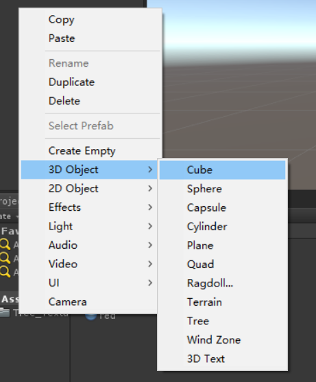

# Unity3D

**Unity页面：**
    Toolbar       工作列
    Hierarchy     树状图
    Scene View    3D工作区/管关卡编辑器
    Inspector     参数栏
    Project       资源管理器

## Unity快捷键
|快捷键                  |作用               |
|-----------------------|-------------------|
|ctrl+d                 |复制选中的物体      |
|Q                      |移动视角            |
|W                      |移动选中的物体      |
|E                      |旋转选中的物体      |
|R                      |收缩选中的物体      |

## Unity界面使用

**移动视角方法：**

- 位移(MMB mouse button)： 点击鼠标滚轮拖动鼠标来进行移动。
    点击右键之后通过`wsad`控制前后左右`qe`控制上下移动。Fly mode:RMB + WASDQE
    在拖拽的时候按住`ctrl`可以一格一格的移动。
- 旋转(RMB)： 点击鼠标右键进行视角的旋转。
    通过`f`键聚焦物体，或在列表中双击物体进行聚焦，之后通过`alt`键并点击左键进行拖拽就可以围绕聚焦的物体进行旋转。lock rotate(focus):f=>alt+LMB
- 缩放(scroll MMB)： 通过滚动滚轮来进行收缩。
    通过`alt`键和右键并拖动鼠标进行画面的缩放。

**操作物体的方法：**
使用这几个键可以快速的对选中的物体进行操作。
  监视模式(Q)
  移动(W)
  旋转(E)
  缩放(R)

  

#### 原形(primatives)

1. Cube       立方体
2. Sphere     球体
3. Quad       四边型(只能渲染一面)
   Plane      平面(点 < 4)
4. Cylinder   圆柱体
5. Capsule    胶囊

#### 材质球(油漆  material)

在工作区右键新建一个`material`，可以做颜色的修改之后拖拽到想要添加材质的物体上面。

1. Albedo       反光色，可以在这项中添加贴图素材。
3. Offset       偏移量，通过调整`x`和`y`轴的数值来改变贴图在模型上的位置
2. Tiling       （Main Maps）重复次数，修改Tiling的`x`和`y`轴的数值来改变贴图在图形中的重复次数
4. Metalic      金属度，金属度越大，显示的反射材质越清晰。
5. Smoothness   平滑度，通过大小来进行平滑度的设置，最大值为1。
6. Normal       法向量贴图（PBR Material）

*`Offset`参数和`Tiling`有两个，在`Secondary`中主要用于细节贴图的修改，例如玻璃上的水滴，`main`针对的是主贴图的修改。*

#### 创建天空素材

创建天空素材需要有天空素材的图片，在Unity中生成天空可以使用天空盒子`skybox`或`HDRI`图片。

**生成天空盒：**
在Unity17版中可以直接将生成好的天空素材通过拖拽的方式放到场景中

*首先将作为素材的图片转为`Cube` 17版可以直接使用当前素材，之后的版本需要新建一个素材样式，并设置`shader`为`skybox`然后将转换好的素材放入立方体贴图中`Cubemap`*

**转换为立方体**

**创建新的样式模型，并设置类型`Shader`为`skybox`**

**修改天空素材：**
生成好的天空盒可以通过调整`色调`、`曝光度`和`角度`

#### 光影反射

**Unity中光影反射的原理是将设置好的天空材质赋值到物体上，通过调整反射参数和物体参数就可以调整反射效果。**
在Unity中物体的反射(Ligthing)有很多参数可以进行设置。

1. 打开`Ligthing`选项栏
  
2. 通过调整参数来设置反射效果
  
  主要通过调整以上几个参数来设置反射效果。

  - *Skybox material：* 选择天空的材质。
  - *Sun Source：* 选择太阳（光源）的位置。
  - *Ligthing：* 光源，环境光。
    - Source：选择反射的材质，有三种模式，可以选择样式，纯色和三色。是在光滑度和金属度最低的时候显示的反射颜色。
    - Intensity Multip：光源的亮度
    - Ambient Mode：环境模式
  - *Reflections：* 反射球
    - Source：选择所有模型的反射材质，默认是选择好的天空材质。
    - Resolution： 背景反射的像素。数值越高，反射出的材质越高。
    - Intensity Mulpit： 背景显示的权重，数值越高，反射的出的材质越逼真。默认数值是1

**Metallic和Smoothness值与反射的关系**
Metallic值越高，环境光就越少，相反就会显示出更多的环境光。
Smoothness的值越高，反射出的效果就越清晰，否则就会模糊。
两者之间互不影响。

#### Unity层级关系
